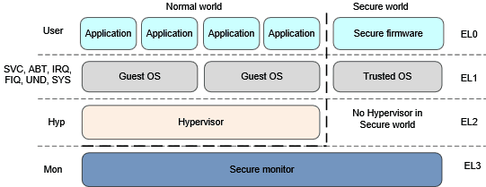

## **中断向量表的建立过程**

### **一 异常基础知识**
* **什么是异常(exception)?**
	对于ARM64而言，异常(exception)是指cpu的某些异常状态或者一些系统的事件(可能来自外部, 也可能来自内部), 这些状态或者事件可以导致cpu去执行一些预先设定的, 具有更高执行权利的软件(exception handler). 执行exception handler可以进行异常的处理, 从而让系统平滑的运行. exception handler执行完毕之后, 需要返回发生异常的现场.

* **异常级别(exception level)**
	一旦异常发生, 系统(包括硬件和软件)将切换到具有更高执行权利的状态, 对于cpu而言，就是exception level了, ARM64最大支持EL0～EL3四个exception level, EL0的execution privilege最低，EL3的execution privilege最高。当发生异常的时候, 系统的exception会迁移到更高的exception level或者维持不变，但是绝不会降低. 此外, 不会有任何的异常会去到EL0.
	
	如果没有支持两个security state(但是支持虚拟化), 那么ARM64有3个exception level, 分别是：EL0（对应user mode的application），EL1（guest OS）和EL2(Hypervisor), 如果支持两个security state（但是不支持虚拟化），ARM64还是有3个exception level，分别是：EL0（对应trusted service），EL1（trusted OS kernel）和EL3（Secure monitor）。如果支持了虚拟化并且同时支持两种security state，那么ARM64的处理器可以处于4种exception level，具体如下:

	
	

* **同步异常和异步异常**
	虽然异常各具形态, 但是基本可以分成两类，一类是asynchronous exception, 另外一类是synchronous exception.
	
	asynchronous exception基本上可以类似平常说的中断，它是毫无预警的，丝毫不考虑cpu core感受的外部事件（需要注意的是：外部并不是表示外设，这里的外部是针对cpu core而言，有些中断是来自SOC的其他HW block，例如GIC，这时候，对于processor或者cpu（指soc）而言，这些事件是内部的), 这些事件打断了cpu core对当前软件的执行，因此称之interrupt。interrupt或者说asynchronous exception有下面的特点：
	1)异常和CPU执行的指令无关.
	2) 返回地址是硬件保存下来并提供给handler，以便进行异常返回现场的处理。这个返回地址并非产生异常时的指令.
	
	异步异常包括: IRQ, FIQ 和SError interrupt.
	
	synchronous exception的特点:
	1) 异常的产生是和cpu core执行的指令或者试图执行执行相关.
	2)硬件提供给handler的返回地址就是产生异常的那一条指令所在的地址.
	
	同步异常包括两类synchronous abort和正常指令执行造成的异常. synchronous abort包括:未定义的指令、data abort、prefetch instruction abort、SP未对齐异常，debug exception等等; 正常指令执行造成的异常包括: SVC/HVC/SMC指令.
	
	
* **异常分类**
* 中断
	中断主要有两种，physical interrupt和virtual interrupt。physical interrupt是来自cpu core（或者叫做PE）外部一种信号，它包括下面三种类型：
	1) IRQ
	2) FIQ
	3) System error，简称SError

	IRQ和FIQ是广大ARM嵌入式工程师的老朋友了，大家常说的中断实际上特指IRQ和FIQ，当然，实际上SError也是一种中断类型。IRQ和FIQ分别和cpu core的nIRQ和nFIQ这两根实际的信号线相关，interrupt controller收集各种来自外设的（或者来自其他CPU core的）中断请求，通过nIRQ和nFIQ的电平信号（active low）来通知cpu core某些外设的异步事件（或者来自其他CPU core的异步事件）。其中IRQ是普通中断，而FIQ是快速中断。由于中断来自cpu core的外部，可以在任何的时间点插入，和cpu core上执行的指令没有任何的关系，因此中断这种exception被归入asynchronous exception类别。

	要想理解SError interrupt这个概念，我们需要先看看external abort这个术语。external abort来自memory system，当然不是所有的来自memory system的abort都是external abort，例如来自MMU的abort就不是external abort（这里的external是针对processor（而非cpu core）而言，因此MMU实际上是internal的）。external abort发生在processor通过bus访问memory的时候（可能是直接对某个地址的读或者写，也可能是取指令导致的memory access），processor在bus上发起一次transaction，在这个过程中发生了abort，abort来自processor之外的memory block、device block或者interconnection block，用来告知processor，搞不定了，你自己看着办吧。external abort可以被实现成synchronous exception（precise exception），也可以实现成asynchronous exception（imprecise exception）。如果external abort是asynchronous的，那么它可以通过SError interrupt来通知cpu core.

* reset

	reset是一种优先级最高的异常，无法mask。系统首次上电，watchdog以及软件控制都可以让cpu core历经一次reset。reset有两种，一种是cold reset，另外一种是warm reset，它们之间唯一的不同是是否reset cpu core build-in的debug HW block。

* abort

	abort有两种，一种是和指令的执行有关，进入异常状态时候保持的返回地址精准的反应了发生异常的那一条指令，我们称之synchronoud abort。有同步就有异步，asynchronous abort（也就是上面描述的SError interrupt）和执行的指令无关，返回地址也不会提供abort时候的执行指令相关的精准信息。asynchronous abort和中断类似，只不过中断多半是来自外部（外设或者其他cpu core），而asynchronous abort来自外部memory system，源于bus上的一些错误，例如不可恢复的ECC error。

	synchronoud abort有可能在cpu执行指令过程中的任何一步发生。例如在取指阶段失败，在译码阶段失败，在指令执行阶段等等。synchronoud abort和指令的执行过程有关，abort有可能在很早的阶段就被感知到，例如cpu core在将保存在memory系统中的指令读取到cpu core内部准备译码执行的时候就发现了错误，怎么办呢？由于指令还没有进入执行阶段（正在执行的是pipeline中的其他指令），因此不能触发exception，而是仅仅mark这个abort，一旦该指令在pipeline中到底execute stage，一次synchronoud abort被触发了。如果还没有执行cpu core就flush了这个pipeline（例如该指令的上一条指令是跳转指令），那么这次abort不会触发。

* 异常指令

	对于ARM而言，system call被运行在non-privilege的软件用来向运行在privilege mode（例如linux kernel）的软件申请服务。来到ARM64，privilege包括了EL1/EL2/EL3，随之而来的是system call这个概念的扩展。从low privilege level都可以通过系统调用来申请higer privilege level的服务，因此，在ARM64中，能正常产生异常（不是abort）并申请拥有更高权利的软件服务的指令有三条：

	1) Supervisor Call (SVC)指令。类似于ARM时代的SWI指令，主要被EL0（user mode）的软件用来申请EL1（OS service）软件的服务。
	2) Hypervisor Call (HVC) 指令。主要被guest OS用来请求hypervisor的服务。
	3) Secure monitor Call (SMC) 指令，用来切换不同的世界，normal world或是secure world。

* **exception level迁移**
	不同的exception level使用相同的general purpose registers，按64bit访问的话，寄存器是x0～x30共计31个寄存器，如果按照32bit访问的话，寄存器是w0～w30。

	每个exception level都有自己的stack pointer register，名字是SP_ELx，当然，前提是处理器支持该EL。对于EL0，只能使用SP_EL0，对于其他的exception level，除了可以使用自己的SP_ELx，还可以选择使用SP_EL0。

	当发生异常的时候，PE总是把当前cpu的状态保存在SPSR寄存器中，该寄存器有三个，分别是SPSR_EL1，SPSR_EL2，SPSR_EL3，异常迁移到哪一个exception level就使用哪一个SPSR。由于不会有异常把系统状态迁移到EL0，因此也就不存在SPSR_EL0了。在返回异常现场的时候，可以使用SPSR_ELx来恢复PE的状态。

	当发生异常的时候，PE把一个适当的返回地址保存在ELR（Exception Link Register）寄存器中，该寄存器有三个，分别是ELR_EL1，ELR_EL2，ELR_EL3，异常迁移到哪一个exception level就使用哪一个ELR。同样的，由于不会有异常把系统状态迁移到EL0，因此也就不存在ELR_EL0了。在返回异常现场的时候，可以使用ELR_ELx来恢复PC值。

	对于abort（包括synchronous exception和SError interrupt），ESR寄存器（ Exception Syndrome Register）保存了更详细的异常信息。ESR寄存器有三个，分别是ESR_EL1，ESR_EL2，ESR_EL3。
	
* **exception handler**
	系统有那么多异常，不同的异常有可以将处理器状态迁移到不同的exception level中，如何组织这些exception handler呢？第一阶是各个exception level的Vector Base Address Register (VBAR)寄存器，该寄存器保存了各个exception level的异常向量表的基地址。该寄存器有三个，分别是VBAR_EL1，VBAR_EL2，VBAR_EL3。

	具体的exception handler是通过vector base address ＋ offset得到，offset的定义如下表所示：

exception level迁移情况|Synchronous exception的offset值|IRQ和vIRQ exception的offset值|FIQ和vFIQ exception的offset值|SError和vSError exception的offset值
--|:--:|--:|--:
同级exception level迁移，使用SP_EL0。例如EL1迁移到EL1|0x000|0x080|0x100|0x180
同级exception level迁移，使用SP_ELx。例如EL1迁移到EL1|0x200|0x280|0x300|0x380
ELx迁移到ELy，其中y>x并且ELx处于AArch64状态|0x400|0x480|0x500|0x580
ELx迁移到ELy，其中y>x并且ELx处于AArch32状态|0x600|0x680|0x700|0x780

	
### **中断向量表的建立**
下文基于linux-4.9内核叙述一下arm64中断向量表的建立过程.

```
_head:
        /*
         * DO NOT MODIFY. Image header expected by Linux boot-loaders.
         */
#ifdef CONFIG_EFI
        /*
         * This add instruction has no meaningful effect except that
         * its opcode forms the magic "MZ" signature required by UEFI.
         */
        add     x13, x18, #0x16
        b       stext
#else
        b       stext                           // branch to kernel start, magic
        .long   0                               // reserved
#endif
        le64sym _kernel_offset_le               // Image load offset from start of RAM, little-endian
        le64sym _kernel_size_le                 // Effective size of kernel image, little-endian
        le64sym _kernel_flags_le                // Informative flags, little-endian
        .quad   0                               // reserved
        .quad   0                               // reserved
        .quad   0                               // reserved
        .byte   0x41                            // Magic number, "ARM\x64"
        .byte   0x52
        .byte   0x4d
        .byte   0x64
......
```
CONFIG_EFI这个宏在arm server上会启用, 当启用后, kernel会打包成一个uefi 的application, 由uefi boot manager来启动. 因此会直接执行stext分支.

```
ENTRY(stext)
        bl      preserve_boot_args
        bl      el2_setup                       // Drop to EL1, w0=cpu_boot_mode
        adrp    x23, __PHYS_OFFSET
        and     x23, x23, MIN_KIMG_ALIGN - 1    // KASLR offset, defaults to 0
        bl      set_cpu_boot_mode_flag
        bl      __create_page_tables
        /*
         * The following calls CPU setup code, see arch/arm64/mm/proc.S for
         * details.
         * On return, the CPU will be ready for the MMU to be turned on and
         * the TCR will have been set.
         */
        bl      __cpu_setup                     // initialise processor
        b       __primary_switch
ENDPROC(stext)
```
在该分支中, 首先进行保存启动参数, el2的建立, 页表的建立等等工作后, 会执行__primary_switch分支.

```
__primary_switch:
#ifdef CONFIG_RANDOMIZE_BASE
        mov     x19, x0                         // preserve new SCTLR_EL1 value
        mrs     x20, sctlr_el1                  // preserve old SCTLR_EL1 value
#endif

        bl      __enable_mmu
#ifdef CONFIG_RELOCATABLE
        bl      __relocate_kernel
#ifdef CONFIG_RANDOMIZE_BASE
        ldr     x8, =__primary_switched
        adrp    x0, __PHYS_OFFSET
        blr     x8

        /*
         * If we return here, we have a KASLR displacement in x23 which we need
         * to take into account by discarding the current kernel mapping and
         * creating a new one.
         */
        msr     sctlr_el1, x20                  // disable the MMU
        isb
        bl      __create_page_tables            // recreate kernel mapping

        tlbi    vmalle1                         // Remove any stale TLB entries
        dsb     nsh

        msr     sctlr_el1, x19                  // re-enable the MMU
        isb
        ic      iallu                           // flush instructions fetched
        dsb     nsh                             // via old mapping
        isb

        bl      __relocate_kernel
#endif
```
在该分支中, 会进行mmu的使能, 重新初始化页表以及重定位kernel等等. 在其中, 会进入__primary_switched分支中进行中断向量表建立.
```
__primary_switched:
        adrp    x4, init_thread_union
        add     sp, x4, #THREAD_SIZE
        adr_l   x5, init_task
        msr     sp_el0, x5                      // Save thread_info

        adr_l   x8, vectors                     // load VBAR_EL1 with virtual
        msr     vbar_el1, x8                    // vector table address
        isb

        stp     xzr, x30, [sp, #-16]!
        mov     x29, sp

        str_l   x21, __fdt_pointer, x5          // Save FDT pointer

        ldr_l   x4, kimage_vaddr                // Save the offset between
        sub     x4, x4, x0                      // the kernel virtual and
        str_l   x4, kimage_voffset, x5          // physical mappings

        // Clear BSS
        adr_l   x0, __bss_start
        mov     x1, xzr
        adr_l   x2, __bss_stop
        sub     x2, x2, x0
        bl      __pi_memset
        dsb     ishst                           // Make zero page visible to PTW
......
```
在该分支中会将中断向量表(vectors)存入到VBAR_EL1中, 完成中断向量表的建立. 

```
路径: arch/arm64/kernel/entry.S

         .macro kernel_ventry, el, label, regsize = 64
         .align 7
 #ifdef CONFIG_UNMAP_KERNEL_AT_EL0
 alternative_if ARM64_UNMAP_KERNEL_AT_EL0
         .if     \el == 0
         .if     \regsize == 64
         mrs     x30, tpidrro_el0
         msr     tpidrro_el0, xzr
         .else
         mov     x30, xzr
         .endif
         .endif
 alternative_else_nop_endif
 #endif
 
         sub     sp, sp, #S_FRAME_SIZE
         b       el\()\el\()_\label
         .endm
/*
 * Exception vectors.
 */
        .pushsection ".entry.text", "ax"

        .align  11
ENTRY(vectors)
        kernel_ventry   1, sync_invalid                 // Synchronous EL1t
        kernel_ventry   1, irq_invalid                  // IRQ EL1t
        kernel_ventry   1, fiq_invalid                  // FIQ EL1t
        kernel_ventry   1, error_invalid                // Error EL1t

        kernel_ventry   1, sync                         // Synchronous EL1h
        kernel_ventry   1, irq                          // IRQ EL1h
        kernel_ventry   1, fiq_invalid                  // FIQ EL1h
        kernel_ventry   1, error_invalid                // Error EL1h

        kernel_ventry   0, sync                         // Synchronous 64-bit EL0
        kernel_ventry   0, irq                          // IRQ 64-bit EL0
        kernel_ventry   0, fiq_invalid                  // FIQ 64-bit EL0
        kernel_ventry   0, error_invalid                // Error 64-bit EL0

#ifdef CONFIG_COMPAT
        kernel_ventry   0, sync_compat, 32              // Synchronous 32-bit EL0
        kernel_ventry   0, irq_compat, 32               // IRQ 32-bit EL0
        kernel_ventry   0, fiq_invalid_compat, 32       // FIQ 32-bit EL0
        kernel_ventry   0, error_invalid_compat, 32     // Error 32-bit EL0
#else
        kernel_ventry   0, sync_invalid, 32             // Synchronous 32-bit EL0
        kernel_ventry   0, irq_invalid, 32              // IRQ 32-bit EL0
        kernel_ventry   0, fiq_invalid, 32              // FIQ 32-bit EL0
        kernel_ventry   0, error_invalid, 32            // Error 32-bit EL0
#endif
END(vectors)
```
异常向量表是分组的, 每一组都包括四种类型的exception, 分别对应synchronous exception(elx_sync or elx_sync_invalid), irq中断(elx_irq or elx_irq_invalid), fiq中断（elx_fiq or elx_fiq_invalid）以及SError中断（elx_error or elx_error_invalid）.

第一组异常对应异常状态的迁移是EL1到EL1的迁移，并且选择使用了SP_EL0.
第二组异常对应异常状态的迁移是EL1到EL1的迁移，并且选择使用了SP_ELx.
第三组异常对应异常状态的迁移是ELx到ELy的迁移(y>x), Elx 处于aarch64.
第四组异常对应异常状态的迁移是ELx到ELy的迁移(y>x), Elx 处于aarch32.

参考博客: [ARM64的启动过程之（六）：异常向量表的设定](http://www.wowotech.net/?post=238)